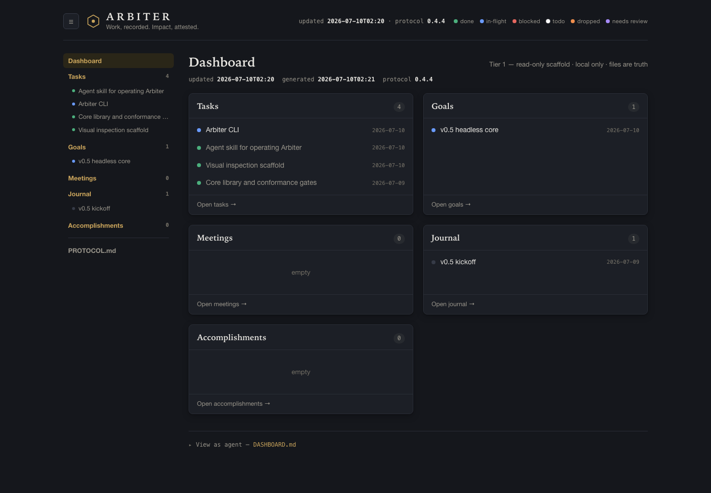
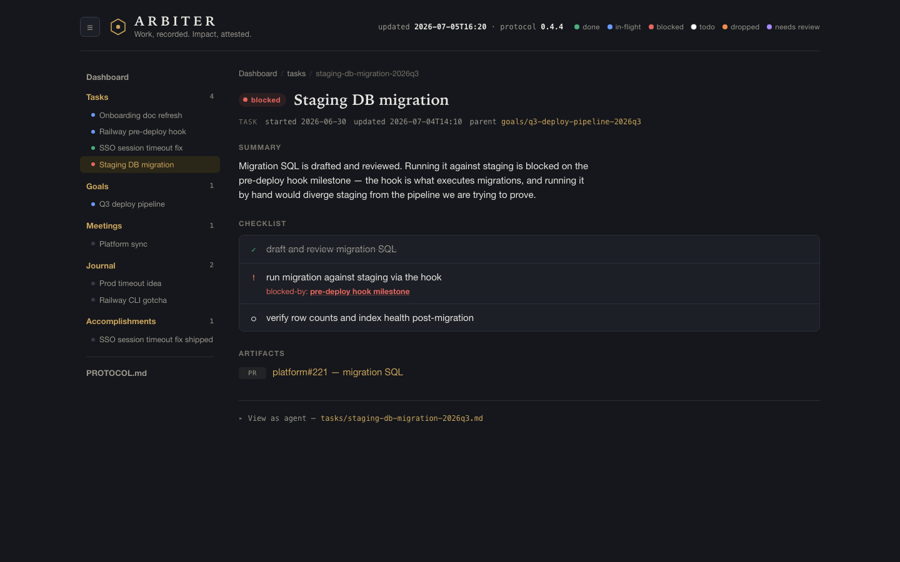
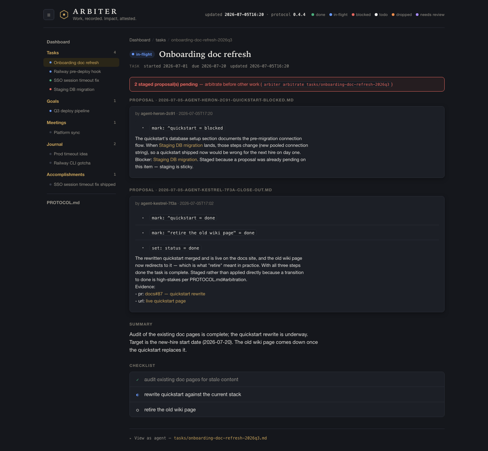

# Arbiter

> Work, recorded. Impact, attested.

Arbiter is an agentic knowledge-base tool that captures the work you perform and renders it as progressively disclosed summaries — inspectable by humans at a glance, and by agents with minimal context. It tracks what's done, what's in flight, what's blocked (and by what), and builds the attestation trail that proves your impact when review season comes.


*The tier-1 dashboard (`arbiter serve`, live data): card board with relevance ordering, status legend, freshness stamps, collapsible fast-nav. Light and dark themes follow the system.*

## Mission

Build, track and create hi-fidelity datapoints meant to improve daily performance by capturing work performed and rendering impactful, meaningful attestation summaries.

## The three tiers

Progressive disclosure is the core design principle: each tier holds just enough to decide whether to go deeper, so neither a human nor an agent is ever handed more context than the question requires.

| Tier | View | Contains |
|------|------|----------|
| **1 — Dashboard** | Card board (Tasks, Goals, Meetings, Journal, Accomplishments — extensible) | Up to 5 items per card ordered by relevance: active items (blocked / in-flight / todo) by recency first, done items last, aged off the card 7 days after completion. One screen answers "what have I done recently, what should I do next?" |
| **2 — Card / Item** | Full item list per card; item detail page | High-level summary, time fields (started / estimated completion / due, with overdue flagging), status checklist (done / in-flight / blocked-with-blocker-link / todo), hyperlinked artifacts (PRs, design docs, Figma, Confluence), links into tier 3 |
| **3 — Documents** | Rendered detail documents | Plans, investigations, reports, notes — the full-context material |

Status colors: **todo = white**, **done = green**, **in-flight = blue**, **blocked = red**, **dropped = orange** (terminal, excluded from accomplishments), **needs-review = purple** (set by triage when an item goes untouched 14+ days). Tier-2 lists paginate at 10; the journal is date-segmented — its card shows the 5 most recent entries and its tier-2 page shows the last week first, older entries behind pagination.

Accomplishments are records rather than work items — review-ready impact statements built for performance-review inspection by humans and agents alike. **Evidence is the driver**: every accomplishment carries verifiable links (merged PRs, published docs) under its Evidence section. Journal and meeting entries carry a subtle **private** toggle; agents skip private items unless explicitly directed.

## Storage model

Markdown files on disk with YAML frontmatter. Agents read and write them with plain file tools — no API required — and the UI is a renderer over the files.

```
arbiter-data/
├── PROTOCOL.md                   # agent contract: per-tier navigation + repair rules
├── DASHBOARD.md                  # tier 1: index, ≤5 relevant per card
├── tasks/
│   ├── <task-slug>.md            # tier 2: frontmatter + summary + checklist + artifacts
│   └── <task-slug>/
│       ├── plan.md               # tier 3: detail documents
│       └── investigation.md
├── goals/
├── meetings/
├── journal/
└── accomplishments/
```

## Agent protocol (top-level priority)

Agents may operate Arbiter with full autonomy, so clean navigation and minimal context are load-bearing:

- **`PROTOCOL.md` is read once** — it defines how to read/write each tier, checklist mark semantics, the tier-1 ordering rule, and capture etiquette.
- **Every other file ends with a single scoped pointer line** (`<!-- arbiter:tier-2 · PROTOCOL.md#tier-2 · … -->`) naming its tier and the section that governs it. Instructions are never repeated per file, so visiting an item never loads navigation guidance meant for its neighbors.
- **Pointers are the only navigation**: tier-1 entries end with `-> path`; tier-2 links tier-3 docs explicitly. An agent opens exactly the files its current tier points to — no bulk reads.
- **Human entries are always valid**: a title plus prose is an acceptable file. Missing fields get defaults (status=todo, type from directory, updated from mtime), and the next agent touch normalizes the entry without ever discarding human prose. Humans may also hand-add entries at any tier — including the dashboard index — and the app reconciles them into item stubs on regeneration. Humans get friendliness; agents get safeguards.
- **Slugs are immutable addresses** of the form `<base>-YYYYqN`; recurrence within ±2 quarters reopens the item, beyond that it's new. Items may carry `parent:`/`related:` frontmatter for epics and loose sibling references, reached only when the current item lacks the answer.
- **Concurrent writes are arbitrated**: uncontended edits apply directly (write-then-verify); contended or high-stakes edits stage as intent-carrying proposal files in `<id>.staged/` and are merged by confluent resolution rules — no silent loss at any writer count. See [`docs/arbitration.md`](docs/arbitration.md).

Arbiter is collaborative and headed toward being an application (likely a web app) so that index regeneration, pagination, triage, and archive stamping happen programmatically instead of burdening agents. Logseq remains the closest architectural reference, now on both sides of its 2026 split: its file-canonical version validates files-as-truth at Arbiter's scale, and its database version contributes the typed card-schema and parse-to-index patterns — see [`docs/logseq-investigation.md`](docs/logseq-investigation.md).

## Getting started

### Prerequisites

- **Node.js ≥ 22** (`node --version`) and npm. The repo pins the engine in `package.json`.
- The only runtime dependency is `better-sqlite3`, which ships prebuilt binaries for common platforms. If your platform has no prebuild, `npm install` falls back to compiling it, which needs a C++ toolchain (macOS: `xcode-select --install`; Debian/Ubuntu: `build-essential` + `python3`).

### Build and test

```sh
npm install        # install deps (native build only if no prebuilt binary exists)
npm test           # typecheck + conformance gates 1–7 (17 tests, fixture corpus as oracle)
npm run build      # compile to dist/ (enables bin/arbiter.js)
```

### Run the CLI

During development (no build needed):

```sh
npm run --silent arbiter -- validate --data arbiter-data
npm run --silent arbiter -- regen    --data arbiter-data
```

After `npm run build`, `bin/arbiter.js` is a plain executable. To put `arbiter` on your PATH for the dev trial, use the **temporary** dev bind:

```sh
scripts/dev-bind.sh install     # wrapper at ~/.local/bin/arbiter + ARBITER_DATA in bash profiles
scripts/dev-bind.sh uninstall   # removes everything it installed (fenced marker blocks)
```

This is scaffolding, not the install story: it hard-codes this repo's paths and edits bash profiles. The v1.0 install story ([`docs/launch-plan.md`](docs/launch-plan.md)) replaces it, and running `uninstall` is part of that cleanup. Once bound:

```sh
arbiter validate                 # judge the data directory against grammar + type schemas
arbiter regen [--full]           # regenerate DASHBOARD.md (incremental by default)
arbiter triage                   # needs-review stamps, archive flags, 24h staged sweep
arbiter query <sub> [--json]     # overdue | needs-review | staged | active <dir> | page <dir> [n] | chain <ref>
arbiter new <type> <title...>    # create an item (slug form + reopen rule enforced)
arbiter arbitrate <dir>/<id>     # apply/resolve staged proposals (pure, confluent)
arbiter write <path> --if-match <sha256|new>   # CAS write; content from stdin or --file
arbiter normalize [--dry-run]    # liberal → canonical repair pass (idempotent)
arbiter serve [--port 4870]      # read-only local renderer (visual inspection)
arbiter hash <path>              # sha256 for the --if-match flow
```

Bare `arbiter` (no command) defaults to `serve` — the everyday entry point.

### Visual inspection (`arbiter serve`)

`arbiter serve` starts a **read-only, local-only** web renderer over the data directory — the v0.6 renderer's scaffold, pulled forward so the dogfood trial can validate inputs visually. It renders all three tiers (dashboard cards with status colors and staged flags, item pages with checklists/blockers/artifacts and pending proposals inline, tier-3 docs), plus a *view as agent* link on every page showing the exact file bytes. Every request re-reads the files, so a browser refresh always shows current truth; there is no write path.

**Privacy posture**: the server binds `127.0.0.1` only — the data directory is personal work data and is never exposed to a public audience. (`--host` can override the bind address, loudly, for e.g. a private tailnet; don't.) The GitHub repo is likewise private.


*Tier 2, a blocked task: the `[!]` step carries its `blocked-by:` link into the goal's anchored milestone; artifacts are typed links.*


*The arbitration surface (fixture corpus): two agents staged competing intents against the same base — one closing the task with PR evidence, one blocking it on a migration. The banner names the exact command; each proposal shows its ops and its why. `arbiter arbitrate` resolves this deterministically.*

Every command takes `--data <dir>` (default: `./arbiter-data`) and `--now <YYYY-MM-DDTHH:MM>` (for deterministic runs; defaults to wall clock). CI runs `npm test` plus `arbiter validate` over both the fixture corpus and the frozen dogfood corpus in `arbiter-data/`. That in-repo corpus is a conformance target, not the live KB — the live KB lives outside this repo at `$ARBITER_DATA` (see CLAUDE.md).

## Status

**v0.5 — headless core (library + CLI), dogfooding.** The v0.4 contract ([`arbiter-data/PROTOCOL.md`](arbiter-data/PROTOCOL.md), type schemas in [`arbiter-data/types/`](arbiter-data/types/), the normative machine-read grammar in [`docs/grammar.md`](docs/grammar.md), arbitration in [`docs/arbitration.md`](docs/arbitration.md)) is now implemented as a TypeScript core (`src/core/`) and CLI (`src/cli/`): parser, byte-stable canonical serializer, idempotent normalizer, schemas-as-data validator, disposable SQLite index, incremental dashboard regeneration, and arbitration as a pure confluent function. Grammar §13's conformance gates 1–7 are the property-test suite, run against [`fixtures/arbiter-data/`](fixtures/arbiter-data/) — including a staged two-proposal conflict whose arbitration is pinned byte-for-byte. Implementation decisions are recorded in [`docs/v0.5-decisions.md`](docs/v0.5-decisions.md); Arbiter's own development is tracked in [`arbiter-data/`](arbiter-data/) from day one.

The visual prototype: Open [`prototype/dashboard.html`](prototype/dashboard.html) in a browser. It is fully self-contained (no build, no network) and demonstrates:

- Tier 1 board with relevance ordering (active first, done last, 7-day age-off), truncation, and status legend
- Tier 2 card lists with status filters and due dates, and item detail pages with time fields, checklists, blocker links, artifacts, and tier-3 links
- Tier 3 rendered documents, plus the rendered `PROTOCOL.md` agent contract
- A collapsible left sidebar for fast navigation across all cards and items
- An Accomplishments card with review-ready impact statements linked to source items
- A raw human entry ("payout report ask") showing the pending-normalization safeguard
- A **"View as agent"** toggle on every view, showing the exact markdown file — including its scoped protocol pointer line — an agent would read/write for that view

Sample data is realistic (drawn from actual project work) so the design can be evaluated against real shapes of information.

## Roadmap (not yet built)

Phased action items live in [`docs/launch-plan.md`](docs/launch-plan.md). In outline:

- Real file storage + renderer (the prototype embeds sample data)
- Capture pipeline: automatic capture from agent sessions, plus a "note for later" inbox for work done outside agentic workflows
- Status-tag maintenance and blocker resolution tracking
- Timeline and impact/attestation reports
- Search
